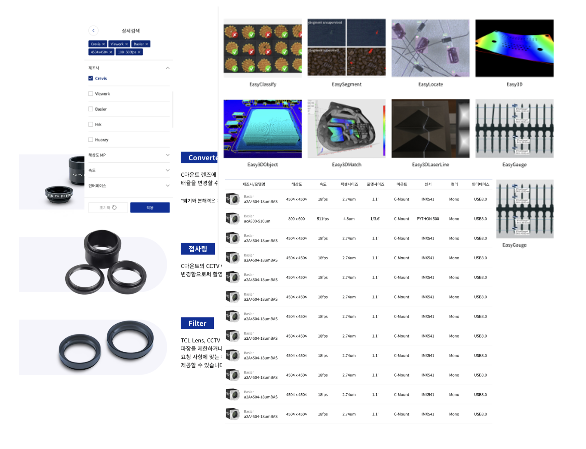
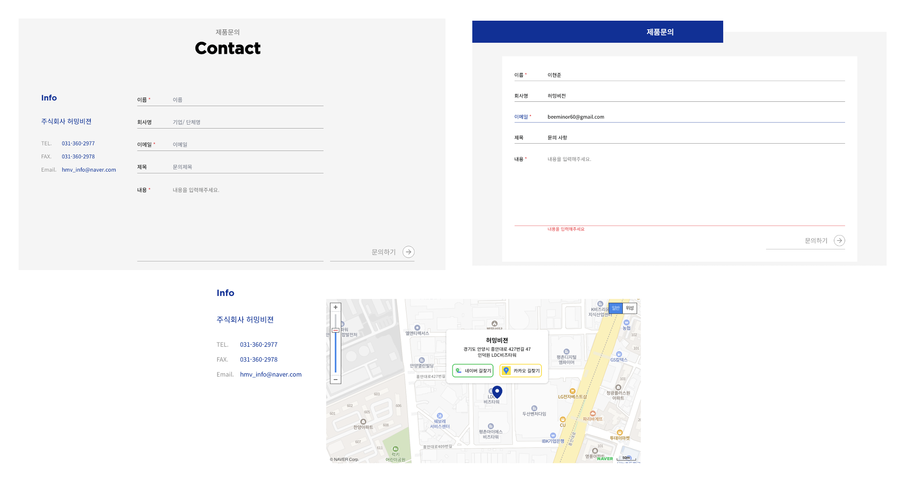
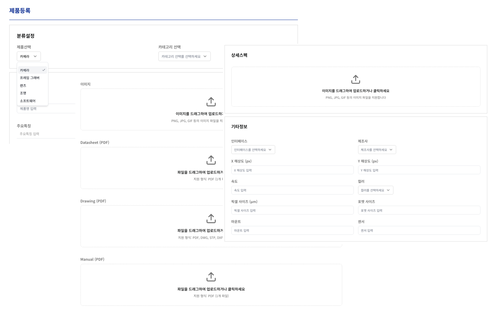
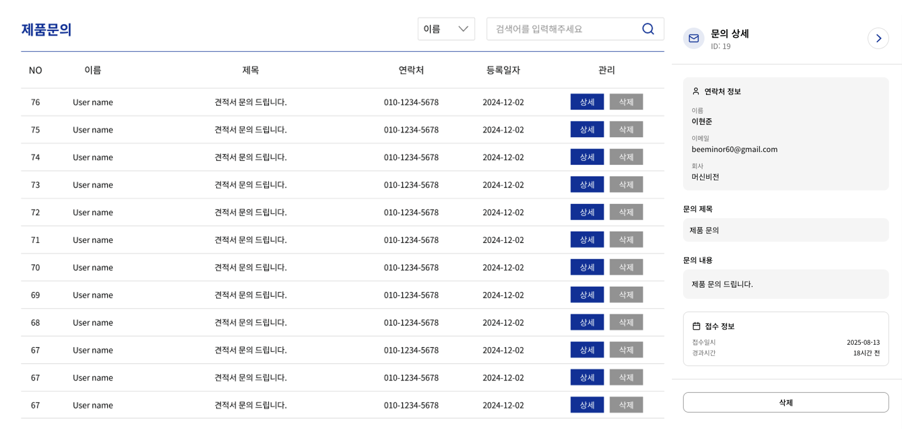

  
  
  # 🔍 Humming Vision
  
  **머신비전 하드웨어 전문기업 홈페이지**
  
  
  
  

---

## 🎯 프로젝트 개요

> **크래비스, 바슬러, 콤퓨타, LVS 등 글로벌 브랜드 머신비전 솔루션을 제공하는 전문기업 홈페이지**

허밍비전은 산업용 머신비전 분야의 혁신적인 시각 솔루션을 제공하는 전문기업입니다.  
본 프로젝트는 **요구사항 분석부터 인프라 설계까지 전 과정을 직접 설계**하여,  
고객과 관리자 모두가 편리하게 사용할 수 있는 **완전한 웹 플랫폼**을 구축했습니다.

 

## 📅 프로젝트 정보

<table>
  <tr>
    <td><strong>🔍 요구사항 분석</strong></td>
    <td>2025.02 ~ 2025.03</td>
  </tr>
  <tr>
    <td><strong>⚡ 개발 기간</strong></td>
    <td>2025.04 ~ 2025.07</td>
  </tr>
  <tr>
    <td><strong>🌐 배포 사이트</strong></td>
    <td><a href="https://www.hummingvision.com/">hummingvision.com</a></td>
  </tr>
    <tr>
    <td><strong>📋 스토리보드</strong></td>
    <td><a href="https://www.figma.com/design/waxsJ1lV1zmwgTKYQ58duk/%ED%97%88%EB%B0%8D%EB%B9%84%EC%A0%84-%EC%8A%A4%ED%86%A0%EB%A6%AC-%EB%B3%B4%EB%93%9C?node-id=0-1&p=f&t=W4uhbc3hwpmSbpyA-0">Story Board</a></td>
  </tr>
  <tr>
    <td><strong>🎨 디자인</strong></td>
    <td><a href="https://www.figma.com/design/aszBUPjoiS0VTmrEOB1OqP/%ED%97%88%EB%B0%8D%EB%B9%84%EC%A0%84?node-id=22-1147&p=f&t=TfvWoKwmb4ZFzC3S-0">Figma Design</a></td>
  </tr>
</table>

 

## 🛠️ 기술 스택

### 🎨 Frontend

### ⚙️ Backend

### 🚀 Infrastructure & DevOps

### 🔧 Development Tools

 

## ✨ 주요 기능

### 👥 고객 서비스

<table>
  <tr>
    <td align="center"><strong>🔍 제품 탐색</strong></td>
    <td align="center"><strong>📧 상품 문의</strong></td>
  </tr>
  <tr>
    <td width="50%">
      
    </td>
    <td width="50%">
      
    </td>
  </tr>
  <tr>
    <td>• 카테고리별 제품 검색 • 상세 필터링 기능 • 반응형 제품 카탈로그</td>
    <td>• 이메일 문의 시스템 
  </tr>
</table>

### 🛠️ 관리자 서비스

<table>
  <tr>
    <td align="center"><strong>➕ 제품 등록</strong></td>
    <td align="center"><strong>📋 문의 관리</strong></td>
  </tr>
  <tr>
    <td width="50%">
      
    </td>
    <td width="50%">
      
    </td>
  </tr>
  <tr>
    <td>• 다중 이미지 업로드 • 카테고리별 동적 폼 
    <td>• 문의 내역 통합 관리 • 상태별 필터링 
  </tr>
</table>

<table>
  <tr>
    <td align="center"><strong>📦 제품 관리</strong></td>
  </tr>
  <tr>
    <td align="center">
      
    </td>
  </tr>
  <tr>
    <td align="center">• 제품 정보 수정/삭제 • 일괄 관리 기능 
  </tr>
</table>

## 👨‍💻 팀 구성

<table align="center">
  <tr>
    <td align="center">
      <a href="https://github.com/hyeonjun-L">
        
          
        <b>이현준</b>
         
      </a>
    </td>
    <td align="center">
      
        
      <b>수아</b>
       
      UI/UX 디자이너
    </td>
  </tr>
  <tr>
    <td align="center">
      Frontend • Backend DevOps • Architecture
    </td>
    <td align="center">
      UI Design • UX Research Prototyping • Branding
    </td>
  </tr>
</table>

 

---

  
  **🔗 Links**
  
  [**🌐 Live Site**](https://www.hummingvision.com/) | [**🎨 Design**](https://www.figma.com/design/aszBUPjoiS0VTmrEOB1OqP/%ED%97%88%EB%B0%8D%EB%B9%84%EC%A0%84?node-id=22-1147&p=f&t=TfvWoKwmb4ZFzC3S-0) | [**📋 Storyboard**](https://www.figma.com/design/waxsJ1lV1zmwgTKYQ58duk/%ED%97%88%EB%B0%8D%EB%B9%84%EC%A0%84-%EC%8A%A4%ED%86%A0%EB%A6%AC-%EB%B3%B4%EB%93%9C?node-id=0-1&p=f&t=W4uhbc3hwpmSbpyA-0)
  
  **Made with ❤️ by Humming Vision Team**
  

